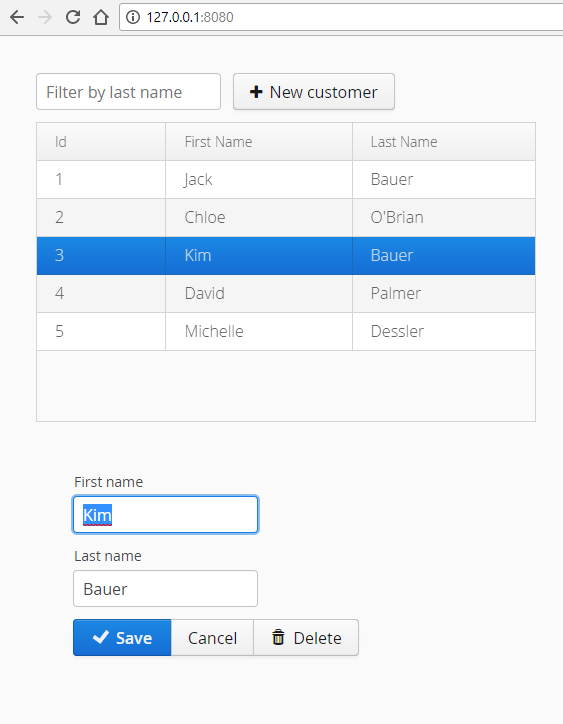

# crud-with-vaadin

As prerequisites you would need:
- Java 8 
- Maven

## Git

Get the repository locally:

```
git clone https://github.com/ermalaliraj/crud-with-vaadin.git
```

## Build the project

Use maven to build the project.

1. Open the command line in the folder 'crud-with-vaadin'
2. Type the following command:

```
mvn clean install
```
Afterwards you will have a target folder containing a jar file needed to run the application.
 
## Run the Application

1. First make sure that the jar file is present (crud-with-vaadin/target/crud-with-vaadin-0.1.0.jar)
2. Use the following command to run the application:
```
java -jar target\crud-with-vaadin-0.1.0.jar
```
3. The Application should now be running and listening in http://127.0.0.1:8080 


 

# See
* [crud-with-vaadin](https://spring.io/guides/gs/crud-with-vaadin/)
 
 